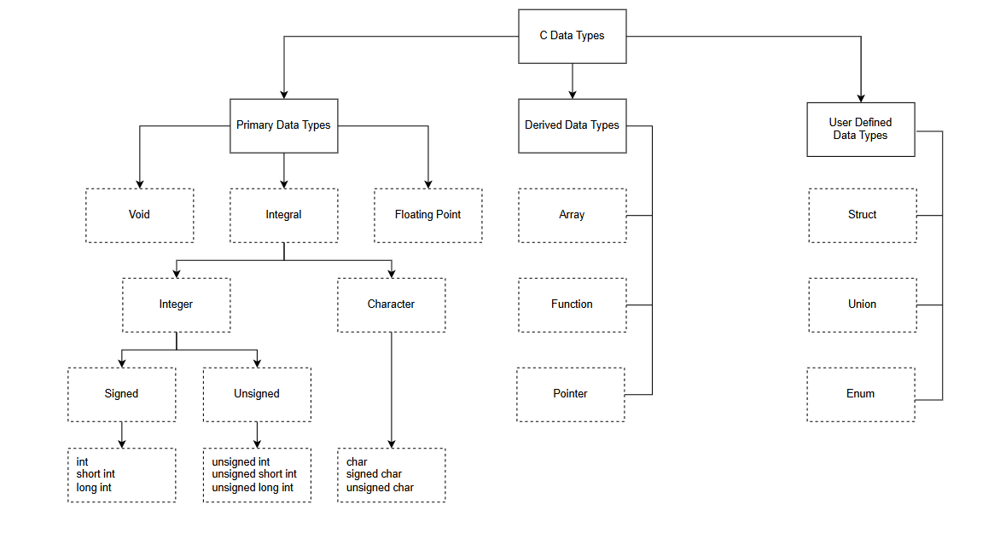

# C Programming Variable in C

## Lesson Objectives

- Variable
- Basic Data Types
- Store Class
- Key words for variable
- Pointer variable
- Struct data type
- Casting

## Section 1: Variable

### Biến là gì?

Biến là một vùng nhớ được đặt tên, dùng để lưu trữ dữ liệu trong chương trình.

### Tại sao cần dùng biến cho lập trình?

- Lưu trữ giá trị tạm thời: Biến cho phép lưu trữ dữ liệu trong RAM để sử dụng lại trong quá trình thực thi chương trình.
- Tái sử dụng dữ liệu: Thay vì nhập đi nhập lại một giá trị, ta có thể lưu nó vào biến và sử dụng nhiều lần
- Dễ dàng thay đổi giá trị: Khi cần cập nhật dữ liệu, ta chỉ cần thay đổi giá trị của biến thay vì sửa nhiều chỗ trong mã nguồn.
- Tăng tính linh hoạt: Biến giúp chương trình hoạt động với nhiều loại dữ liệu đầu vào khác nhau, thay vì chỉ làm việc với giá trị cố định.
- Dễ bảo trì và mở rộng: Sử dụng biến giúp mã nguồn dễ đọc, dễ sửa lỗi và dễ nâng cấp khi cần thay đổi logic xử lý.
- Quản lý bộ nhớ hiệu quả: Hệ thống có thể cấp phát và giải phóng bộ nhớ động khi sử dụng biến, giúp tối ưu hiệu suất.
- Hỗ trợ các thuật toán phức tạp: Các thuật toán như tìm kiếm, sắp xếp, xử lý dữ liệu đều cần biến để lưu trữ trạng thái và tính toán kết quả.

## Section 2: Data type in C



## Section 3: Các đặc điểm của biến

Có 4 đặc điểm của biến:

- Phân biệt biến toàn cục (global) và biến cục bộ (local)
- Thời gian tồn tại của biến (lifetime of a variable)
- Phạm vi của biến (scope of a variable)
- Biến trong bộ nhớ (variable in memory)

### Phân biệt biến toàn cục và biến cục bộ

Biến toàn cục được khai báo bên ngoài tất cả các hàm và có thể được truy cập (sử dụng) trong bất kỳ hàm nào trong chương trình.

Biến cục bộ được khai báo bên trong một hàm và chỉ có thể được sử dụng trong phạm vi của hàm đó. Có thể có các biến cục bộ trùng tên trong các hàm khác nhau mà không ảnh hưởng lẫn nhau.

### Thời gian tồn tại của biến

Biến tự động (Automatic - Local Variables):
- Được khai báo bên trong một khối {} hoặc hàm mà không có từ khóa static.
- Bộ nhớ được cấp phát khi khối/hàm bắt đầu và giải phóng khi kết thúc.
- Giá trị mặc định: Không xác định (chứa giá trị rác).

Biến tĩnh (Static Variables):
- Được khai báo với từ khóa static, có thể bên trong hoặc bên ngoài hàm.
- Thời gian tồn tại: Suốt vòng đời của chương trình.
- Giữ nguyên giá trị giữa các lần gọi hàm.
- Giá trị mặc định: Nếu không khởi tạo, mặc định là 0.

Biến toàn cục (Global Variables)
- Được khai báo bên ngoài tất cả các hàm, không có từ khóa static.
- Thời gian tồn tại: Suốt vòng đời của chương trình.
- Có thể được truy cập bởi tất cả các hàm trong file hoặc trên nhiều file nếu khai báo với extern.

Biến động (Dynamic Variables)
- Được cấp phát bộ nhớ động bằng malloc(), calloc(), hoặc realloc().

### Phạm vi của biến

Phạm vi khối (Block Scope - Local Scope):
- Biến được khai báo bên trong một khối {} là biến cục bộ.
- Chỉ có thể truy cập bên trong khối nơi nó được định nghĩa.
- Thường được sử dụng cho dữ liệu tạm thời.

Phạm vi tệp (File Scope - Global Scope):
- Biến được khai báo bên ngoài tất cả các hàm là biến toàn cục.
- Có thể được truy cập bởi bất kỳ hàm nào trong cùng một file.
- ần sử dụng hạn chế để tránh tác dụng phụ ngoài ý muốn.

Phạm vi hàm (Function Scope):
- Áp dụng cho nhãn (label) dùng trong câu lệnh goto.
- Nhãn có thể được sử dụng trong toàn bộ hàm chứa nó.

Phạm vi tệp với từ khóa static (File Scope with static)
- Biến khai báo với static bên ngoài một hàm chỉ có thể được sử dụng trong file chứa nó.

### Biến trong bộ nhớ

- Biến cục bộ thường được lưu trong stack (ngăn xếp), nhanh nhưng dễ bị ghi đè khi tràn stack.
- Biến toàn cục và biến tĩnh nằm trong vùng dữ liệu (data segment) của bộ nhớ.
- Biến cấp phát động sử dụng heap (vùng nhớ động), cần quản lý thủ công bằng malloc() và free().

## Section 4: Keywork cho biến

### Static

Trong một số ngôn ngữ lập trình như C (và các ngôn ngữ kế thừa như C++, Objective-C và Java), thì biến Static là một từ khóa dành riêng dùng để kiểm soát thời gian tồn tại (lifetime) của biến và phạm vi truy cập (visibility) tùy theo cách liên kết (linkage).

Trong C và C++, static có thể được sử dụng để:
- Xác định biến tĩnh có thời gian tồn tại suốt vòng đời chương trình
- Giới hạn phạm vi của biến hoặc hàm ở mức file cục bộ, tránh bị truy cập từ file khác.

Trong Java, static dùng để khai báo biến hoặc phương thức cấp lớp (class-level), nghĩa là chúng thuộc về lớp thay vì đối tượng cụ thể.


#### Static Global Variable (Biến toàn cục tĩnh)

- Biến toàn cục khai báo với static chỉ có thể được sử dụng trong file khai báo nó.
- Không thể truy cập từ file khác ngay cả khi sử dụng extern.
- Giúp tránh xung đột tên biến khi chương trình có nhiều file.

```c
static int global_var = 10;
```

#### Static Function (Hàm tĩnh)

- Hàm khai báo với static chỉ có thể được gọi trong file khai báo nó.
- Giúp giới hạn phạm vi của hàm, tránh bị gọi từ file khác.

```c
static void myFunction() {
    printf("This function is only accessible in this file.\n");
}
```

#### Static Local Variable (Biến cục bộ tĩnh)

- Biến cục bộ khai báo với static giữ nguyên giá trị giữa các lần gọi hàm.
- Chỉ khởi tạo một lần duy nhất khi chương trình chạy.

```c
void countCalls() {
    static int count = 0; // Chỉ khởi tạo một lần, giữ giá trị giữa các lần gọi
    count++;
    printf("Function called %d times.\n", count);
}

int main() {
    countCalls(); // Output: Function called 1 times.
    countCalls(); // Output: Function called 2 times.
}
```

### Extern

Biến extern được sử dụng để khai báo một biến hoặc hàm toàn cục mà không cấp phát bộ nhớ cho nó. Điều này cho phép các file khác trong chương trình có thể truy cập cùng một biến hoặc hàm được định nghĩa ở nơi khác.

#### Extern Variable

- Biến khai báo với extern không cấp phát bộ nhớ, chỉ là một tham chiếu đến biến đã được định nghĩa ở nơi khác.
- Giúp chia sẻ biến toàn cục giữa các file trong chương trình C.

```c
**
 * @file: file1.c
 * 
int global_var = 10; // Biến toàn cục có bộ nhớ cấp phát

void printGlobal() {
    printf("Global variable: %d\n", global_var);
}
```

```c
**
 * @file: file2.c
 * 
extern int global_var; // Khai báo nhưng không cấp phát bộ nhớ

void modifyGlobal() {
    global_var = 20; // Thay đổi giá trị của biến toàn cục trong file1.c
}
```

#### Extern Function

- Hàm được khai báo với extern giúp gọi hàm từ file khác.
- Thực tế, mặc định tất cả các hàm toàn cục trong C đều có thuộc tính extern, nên không cần thêm từ khóa extern trừ khi cần khai báo rõ ràng trong file header.

```c
**
 * @file: file1.c
 * 
void printMessage() {
    printf("Hello from file1.c!\n");
}
```

```c
**
 * @file: file2.c
 * 
extern void printMessage(); // Khai báo nhưng không định nghĩa

int main() {
    printMessage(); // Gọi hàm từ file1.c
    return 0;
}
```

### Register

Biến register là một biến đặc biệt mà trình biên dịch có thể ưu tiên lưu trữ trong thanh ghi của CPU thay vì bộ nhớ RAM. Điều này giúp truy xuất nhanh hơn, đặc biệt hữu ích cho các biến được sử dụng thường xuyên

Đặc điểm của biến register:
- Truy cập nhanh hơn biến thông thường do lưu trữ trong thanh ghi CPU
- Không thể lấy địa chỉ bằng toán tử & vì biến này không có địa chỉ cố định trong bộ nhớ
- Trình biên dịch có thể bỏ qua yêu cầu register nếu không có đủ thanh ghi CPU
- Chỉ áp dụng cho biến cục bộ bên trong hàm, không thể dùng cho biến toàn cục

Ví dụ sử dụng register trong C

```c
void fastFunction() {
    register int i; // Yêu cầu trình biên dịch lưu biến i trong thanh ghi CPU
    for (int i = 0; i < 10; i++) {
        printf("%d ", i);
    }
}

int main() {
    fastFunction();
    return 0;
}
```

Chúng ta không thể lấy địa chỉ của biến register:

```c
register int x = 10;
printf("%p", &x); // ❌ Lỗi biên dịch!
```

Khi nào nên dùng register:
- Khi cần truy cập biến thường xuyên trong vòng lặp.
- Khi viết hàm tính toán hiệu suất cao yêu cầu tốc độ xử lý nhanh.
- Khi tối ưu chương trình trên hệ thống nhúng hoặc bộ xử lý hạn chế.

### Volatile

Từ khóa volatile được sử dụng để ngăn trình biên dịch tối ưu hóa các biến có thể thay đổi ngoài tầm kiểm soát của nó, chẳng hạn như do phần cứng hoặc các tiến trình đồng thời.

Khi nào cần sử dụng volatile?
- Thanh ghi ngoại vi
- Khi lập trình hệ thống nhúng, các thanh ghi ngoại vi có thể thay đổi giá trị do phần cứng, và trình biên dịch không thể dự đoán điều này
- Nếu không dùng volatile, trình biên dịch có thể loại bỏ các lệnh đọc giá trị từ thanh ghi, dẫn đến lỗi chương trình.

```c
#define STATUS_REG  (*(volatile unsigned int*)0x40021000) // Thanh ghi ngoại vi
void checkStatus() {
    while (STATUS_REG == 0); // Luôn đọc lại từ thanh ghi
}
```

Nếu không dùng volatile, trình biên dịch có thể bỏ qua việc kiểm tra lại giá trị của biến trong vòng lặp vô hạn (while), gây ra lỗi chương trình.

## Section 5: Pointer Variable

Con trỏ là một biến lưu địa chỉ của biến khác trong bộ nhớ. Nó giúp truy cập và thao tác trực tiếp trên vùng nhớ của biến đó.

```c
int a = 10;
int *ptr = &a; // ptr lưu địa chỉ của biến a
```

Đặc điểm của con trỏ:
- Lưu địa chỉ bộ nhớ của biến khác.
- Cho phép truy xuất gián tiếp giá trị của biến.
- Hỗ trợ truyền tham chiếu trong hàm.
- Dùng trong cấp phát động
- Cần được quản lý đúng cách để tránh lỗi truy cập bộ nhớ.

## Section 6: Structure data type (Struct - Union - Enum)

### Struct

Cấu trúc (struct) là một kiểu dữ liệu do người dùng định nghĩa, giúp nhóm nhiều biến có kiểu dữ liệu khác nhau dưới cùng một tên.

```c
struct Student {
    char name[50];
    int age;
    float gpa;
};
```

### Union

Union tương tự như struct, nhưng các thành viên dùng chung một vùng nhớ. Điều này có nghĩa là chỉ một thành viên có thể lưu giá trị tại một thời điểm.

```c
union union_name {
    data_type member1;
    data_type member2;
    ...
};
```

Đặc điểm của Union:
- Các thành viên chia sẻ chung một vùng nhớ.
- Kích thước của union bằng kích thước thành viên lớn nhất.
- Giúp tiết kiệm bộ nhớ trong các chương trình nhúng hoặc yêu cầu tối ưu bộ nhớ.

### Enum

Enum (viết tắt của "enumeration") là một kiểu dữ liệu do người dùng định nghĩa, dùng để đặt tên cho các hằng số nguyên, giúp mã nguồn dễ đọc hơn.

#### Cú pháp khai báo enum:
```c
enum <enum_name> {
    constant1,
    constant2,
    constant3,
    ...
};
```

#### Ví dụ:
```c
enum Day {
    SUNDAY,
    MONDAY,
    TUESDAY,
    WEDNESDAY,
    THURSDAY,
    FRIDAY,
    SATURDAY
};
```
Mặc định, giá trị của SUNDAY là 0, MONDAY là 1, TUESDAY là 2,...

#### Lợi ích của enum

- Giúp code dễ đọc, dễ hiểu.
- Tránh việc sử dụng số "ma thuật" (magic numbers) trong code.
- Dễ dàng thay đổi giá trị mà không ảnh hưởng đến các phần khác của chương trình.