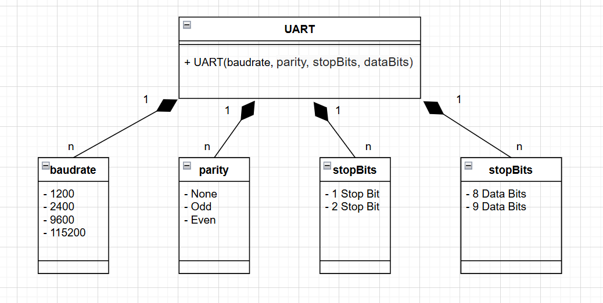
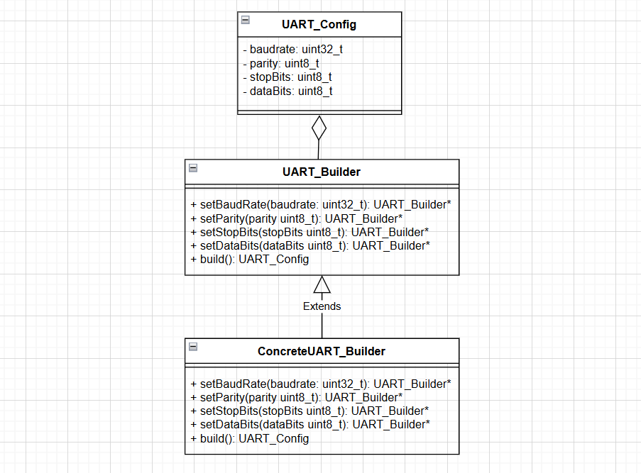

# Builder

## Định nghĩa

Builder Pattern là một Creational Design Pattern cho phép xây dựng đối tượng phức tạp bằng cách sử dụng các đối tượng riêng biệt đại diện cho từng bộ phận cấu thành.

Builder Pattern tách rời quá trình khởi tạo đối tượng phức tạp khỏi các đại diện của nó. Điều này cho phép cùng một quá trình xây dựng có thể tạo ra nhiều biểu diễn khác nhau của đối tượng.

## Mục đích

Builder Pattern được sử dụng để tách rời quá trình khởi tạo đối tượng phức tạp khỏi các đại diện của nó, giúp đạt được những lợi ích sau:

* Tăng tính linh hoạt trong khởi tạo đối tượng phức tạp
* Dễ dàng thay đổi cách khởi tạo đối tượng.
* Hỗ trợ tạo nhiều biểu diễn khác nhau của đối tượng.
* Đơn giản hóa việc test và debug.

Builder Pattern tách rời quá trình xây dựng đối tượng phức tạp thành nhiều bước riêng biệt. Mỗi bước tập trung vào một khía cạnh của đối tượng.

Các đại diện chỉ đơn giản lưu trữ kết quả, không cần quan tâm đến quá trình tạo ra chúng.

## Đặt vấn đề

Trong phát triển phần mềm, ta thường gặp các đối tượng phức tạp với nhiều thuộc tính và thành phần. Giả sử bạn cần cấu hình một giao tiếp UART với các tham số như: Baud rate, Parity, Stop bits, Data bits.



* Quá trình khởi tạo phức tạp, dễ gây nhầm lẫn với nhiều tham số truyền vào
* Các thành phần của UART bị phụ thuộc lẫn nhau, khó thay đổi một phần mà không ảnh hưởng các thành phần khác.
* Khó tạo các biến thể khác nhau của UART một cách linh hoạt.

## Giải quyết vấn đề

Thay vì viết một hàm khởi tạo dài dòng với nhiều tham số, bạn có thể sử dụng Builder Pattern để thiết kế một cách cấu hình linh hoạt và dễ đọc.

## Cấu trúc



* Product: Tương ứng với UART_Config, là đối tượng chứa các thông số cấu hình UART (baud rate, parity, stop bits, data bits).
* Builder: Tương ứng với UART_Builder, cung cấp các phương thức để thiết lập từng thông số của UART_Config.
* ConcreteBuilder: Là triển khai cụ thể của UART_Builder để thiết lập các thông số cấu hình.

## Cách triển khai

Định nghĩa Product:

```c
// UART Configuration Structure
typedef struct {
    uint32_t baudRate;
    uint8_t parity;      // 0: None, 1: Odd, 2: Even
    uint8_t stopBits;    // 1: 1 Stop Bit, 2: 2 Stop Bits
    uint8_t dataBits;    // 8: 8 Data Bits, 9: 9 Data Bits
} UART_Config_t;
```

Định nghĩa Builder:

```c
// UART Builder Structure
typedef struct {
    UART_Config_t config;
    // Function pointers for fluent interface
    struct UART_Builder* (*setBaudRate)(struct UART_Builder*, uint32_t);
    struct UART_Builder* (*setParity)(struct UART_Builder*, uint8_t);
    struct UART_Builder* (*setStopBits)(struct UART_Builder*, uint8_t);
    struct UART_Builder* (*setDataBits)(struct UART_Builder*, uint8_t);
    UART_Config_t (*build)(struct UART_Builder*);
} UART_Builder;

// Function implementations for Builder
UART_Builder* setBaudRate(UART_Builder* builder, uint32_t baudRate) {
    builder->config.baudRate = baudRate;
    return builder;
}

UART_Builder* setParity(UART_Builder* builder, uint8_t parity) {
    builder->config.parity = parity;
    return builder;
}

UART_Builder* setStopBits(UART_Builder* builder, uint8_t stopBits) {
    builder->config.stopBits = stopBits;
    return builder;
}

UART_Builder* setDataBits(UART_Builder* builder, uint8_t dataBits) {
    builder->config.dataBits = dataBits;
    return builder;
}

UART_Config_t build(UART_Builder* builder) {
    return builder->config;
}

// Function to initialize the Builder
UART_Builder UART_Builder_Init() {
    UART_Builder builder;
    builder.config.baudRate = 9600;   // Default baud rate
    builder.config.parity = 0;       // Default parity: None
    builder.config.stopBits = 1;     // Default stop bits: 1
    builder.config.dataBits = 8;     // Default data bits: 8
    builder.setBaudRate = setBaudRate;
    builder.setParity = setParity;
    builder.setStopBits = setStopBits;
    builder.setDataBits = setDataBits;
    builder.build = build;
    return builder;
}
```

Bây giờ, chúng ta có thể sử dụng Builder:

```c
// Main function
int main() {
    // Initialize the Builder
    UART_Builder builder = UART_Builder_Init();

    // Configure UART using the Builder
    UART_Config_t uartConfig = builder
        .setBaudRate(&builder, 115200)
        ->setParity(&builder, 1)
        ->setStopBits(&builder, 2)
        ->setDataBits(&builder, 9)
        ->build(&builder);

    // Print the configured UART parameters
    printf("UART Configuration:\n");
    printf("Baud Rate: %d\n", uartConfig.baudRate);
    printf("Parity: %d\n", uartConfig.parity);
    printf("Stop Bits: %d\n", uartConfig.stopBits);
    printf("Data Bits: %d\n", uartConfig.dataBits);

    return 0;
}
```
