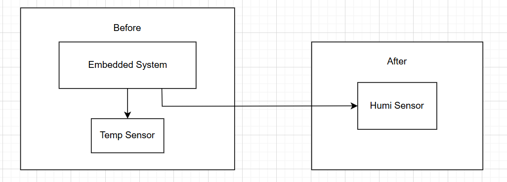
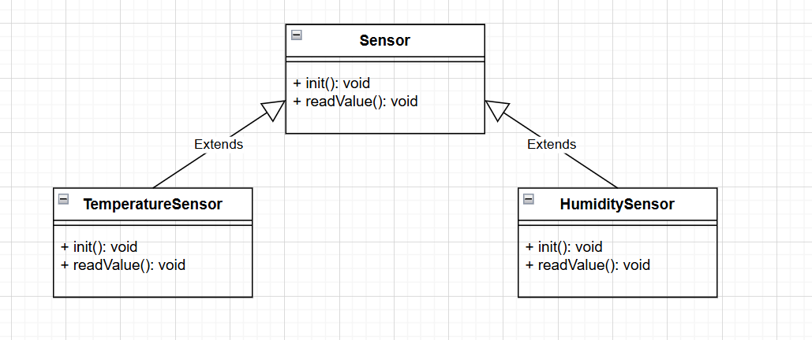
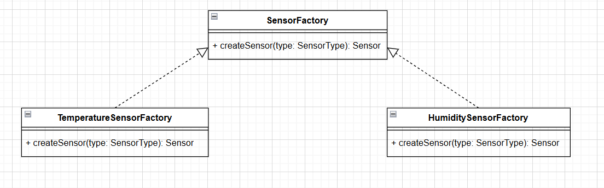
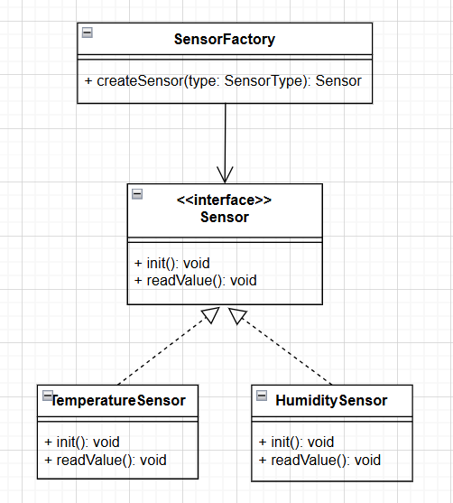

# Factory Method

## Định nghĩa

Factory Method là một Design Pattern thuộc nhóm Creational Patterns (các mẫu thiết kế tạo đối tượng), cung cấp một cách để tạo các đối tượng của lớp một cách linh hoạt mà không cần chỉ định rõ kiểu cụ thể của đối tượng nào sẽ được tạo. Trong lập trình embedded (nhúng), Factory Method có thể được sử dụng để tạo ra các đối tượng cụ thể mà không cần chỉ định lớp cụ thể của chúng.

## Mục đích

Factory Method Pattern được sử dụng để giải quyết việc tạo đối tượng mà không cố định lớp cụ thể nào sẽ được tạo. Các mục đích chính của mẫu này bao gồm:
- Dễ dàng tạo các đối tượng của lớp: Factory Method cho phép tạo các đối tượng của lớp một cách dễ dàng thông qua một phương thức trừu tượng.
- Dễ dàng thay đổi cách tạo các đối tượng của lớp: Bằng cách triển khai lại phương thức factory ở các lớp con, bạn có thể thay đổi cách tạo đối tượng mà không ảnh hưởng đến client code.
- Dễ dàng kiểm tra các đối tượng của lớp: Factory Method cho phép bạn kiểm tra và quản lý các đối tượng được tạo một cách linh hoạt.

## Bài toán

Giả sử bạn đang phát triển hệ thống nhúng để giao tiếp với các cảm biến khác nhau. Ban đầu, hệ thống của bạn chỉ giao tiếp và lấy dữ liệu từ cảm biến nhiệt độ. Tuy nhiên, theo thời gian, bạn nhận thấy nhu cầu của khách hàng đang thay đổi. Người dùng muốn hệ thống có thể đo được độ ẩm không khí.



Việc giao tiếp với một cảm biến khác yêu cầu bạn phải thay đổi toàn bộ hệ thống để tích hợp các API lấy dữ liệu từ cảm biến độ ẩm. Điều này đồng nghĩa với việc sửa đổi và thêm mã nguồn rải rác trong hệ thống, và có thể dẫn đến các vấn đề về tính nhất quán và bảo trì trong tương lai.

Nếu bạn quyết định mở rộng hệ thống bạn sẽ phải duyệt qua toàn bộ mã nguồn một lần nữa và thực hiện các sửa đổi lớn. Điều này dẫn đến mã nguồn trở nên phức tạp và khó bảo trì, không tuân theo nguyên tắc thiết kế mở rộng.

## Giải pháp

Sử dụng Factory Method để tạo ra các đối tượng cảm biến cụ thể mà không cần chỉ định lớp cụ thể của từng loại cảm biến. Ta có thể tạo một giao diện (interface) có tên là **Sensor** với phương thức chung là **init()** và **readValue()**. Sau đó, ta tạo hai lớp cụ thể là **TemperatureSensor** và **HumiditySensor** và cả hai lớp này đều triển khai giao diện **Sensor**



Lớp **TemperatureSensor** có thể triển khai phương thức **Sensor** đọc dữ liệu từ cảm biến nhiệt độ, trong khi lớp **HumiditySensor** triển khai phương thức đó để đọc dữ liệu từ cảm biến độ ẩm.

Tiếp theo, ta tạo một lớp **SensorFactory** với phương thức **createSensor**, và các lớp cụ thể **TemperatureSensorFactory** và **HumiditySensorFactory** kế thừa từ lớp này.



Lớp **TemperatureSensorFactory** sẽ triển khai phương thức **createSensor** để trả về một đối tượng **TemperatureSensor**, trong khi **HumiditySensorFactory** sẽ trả về một đối tượng **HumiditySensor**.

## Cấu trúc



## Cách triển khai

### 1. Định nghĩa Interface (hoặc Abstract Class) cho các cảm biến

Đầu tiên, ta định nghĩa một interface hoặc abstract class cho các cảm biến. Tất cả các loại cảm biến sẽ kế thừa từ interface này.

```c
// Sensor.h
#ifndef SENSOR_H
#define SENSOR_H

typedef struct {
    void (*init)(void);        // Hàm khởi tạo cảm biến
    float (*readValue)(void);  // Hàm đọc giá trị từ cảm biến
} Sensor;

#endif
```

### 2. Cài đặt các lớp cảm biến cụ thể

Mỗi loại cảm biến sẽ có cách triển khai riêng.

**Cảm biến nhiệt độ (Temperature Sensor):**

```c
// TemperatureSensor.c
#include "Sensor.h"
#include <stdio.h>

void tempSensorInit(void) {
    // Code khởi tạo cảm biến nhiệt độ (giả sử giao tiếp I2C)
    printf("Temperature Sensor initialized.\n");
}

float tempSensorReadValue(void) {
    // Code đọc giá trị từ cảm biến nhiệt độ
    return 25.5; // Giá trị giả lập
}

// Tạo đối tượng cảm biến nhiệt độ
Sensor createTemperatureSensor() {
    Sensor tempSensor;
    tempSensor.init = tempSensorInit;
    tempSensor.readValue = tempSensorReadValue;
    return tempSensor;
}
```

**Cảm biến độ ẩm (Humidity Sensor):**

```c
// HumiditySensor.c
#include "Sensor.h"
#include <stdio.h>

void humiditySensorInit(void) {
    // Code khởi tạo cảm biến độ ẩm (giả sử giao tiếp SPI)
    printf("Humidity Sensor initialized.\n");
}

float humiditySensorReadValue(void) {
    // Code đọc giá trị từ cảm biến độ ẩm
    return 60.0; // Giá trị giả lập
}

// Tạo đối tượng cảm biến độ ẩm
Sensor createHumiditySensor() {
    Sensor humiditySensor;
    humiditySensor.init = humiditySensorInit;
    humiditySensor.readValue = humiditySensorReadValue;
    return humiditySensor;
}
```

### 3. Tạo Factory Method

Factory Method sẽ chịu trách nhiệm tạo ra đối tượng cảm biến phù hợp dựa trên loại cảm biến.

```c
// SensorFactory.c
#include "Sensor.h"
#include "TemperatureSensor.c"
#include "HumiditySensor.c"

typedef enum {
    SENSOR_TEMPERATURE,
    SENSOR_HUMIDITY
} SensorType;

Sensor createSensor(SensorType type) {
    switch (type) {
        case SENSOR_TEMPERATURE:
            return createTemperatureSensor();
        case SENSOR_HUMIDITY:
            return createHumiditySensor();
        default:
            // Trường hợp không hợp lệ
            Sensor nullSensor = {0};
            return nullSensor;
    }
}
```

### 4. Sử dụng Factory Method trong Main

```c
#include "Sensor.h"
#include "SensorFactory.c"
#include <stdio.h>

int main() {
    // Tạo cảm biến nhiệt độ
    Sensor tempSensor = createSensor(SENSOR_TEMPERATURE);
    tempSensor.init();
    printf("Temperature: %.2f\n", tempSensor.readValue());

    // Tạo cảm biến độ ẩm
    Sensor humiditySensor = createSensor(SENSOR_HUMIDITY);
    humiditySensor.init();
    printf("Humidity: %.2f\n", humiditySensor.readValue());

    return 0;
}
```

### 5. Kết quả

```bash
Temperature Sensor initialized.
Temperature: 25.50
Humidity Sensor initialized.
Humidity: 60.00
```